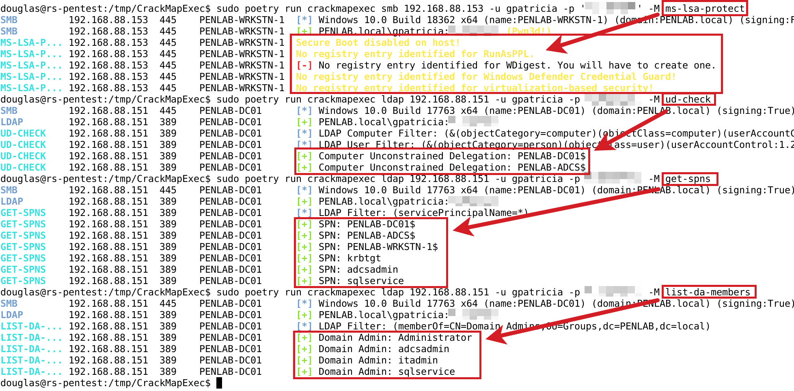

# Custom CME Modules
This repository contains some [CrackMapExec](https://github.com/Porchetta-Industries/CrackMapExec) (CME) modules that I am working on. Some of these probbaly already exist, or the functionality exists within different tools. I am just doing this as an exercise and the plan is to one day make a novel module. 


## Modules
The modules are organized by protocol. use `-L` to see if they are available once you install them into your local instance of CME.
### LDAP
 * [list-da-members](modules/list-da-members.py) - Simply lists out all Domain Admin members for the domain
 * [get-spns](modules/get-spns.py) - Simply list all Service Principle Names for the domain
 * [ud-check](modules/ud-check.py) - Unconstrained Delegation check
### SMB
 * [ms-lsa-protect](modules/ms-lsa-protect.py) - Check a system for various Microsoft's LSA protections (requires admin)

## Usage
Clone the repository and place the module files in `./modules` into your CME modules directory. Then, simply run the following command to see if they are available:
```bash
poetry run crackmapexec (PROTOCOL) -L
```
where (PROTOCOL) is the one listed from above.
